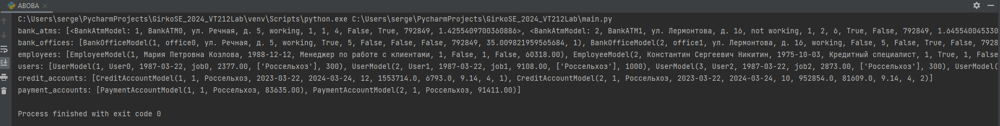

1. В проекте реализованы следующие объекты: Bank, Bank_Atm, Bank_Office, Credit_Office, Employee, Payment_Account, User.
2. Реализованы их поля
3. Реализованы для сущностей операции Create, Read, Update, Delete
4. 
5. Инициализированы 5 разных банков, у каждого по 3 банкомата, офиса (в офисе по 5 сотрудников), у банков по 5 клиентов (указаны по 2 счета: плетежных и кредитных)